# Rebase Example

## 1. 테스트 환경 생성
- github에서 remote new repo 생성
    - e.g. git_test
- local에 clone
    ```bash
    $ git clone https://github.com/ygene2/git_test
    ```
- 파일 생성
    ```bash
    $ touch my_script.py
    ```
- 아래 내용 `my_script.py`에 입력
    ```python
    # -*- coding: utf-8 -*-
    
    
    def main():
    
        for i in range(10):
            print(i)
    
    
    if __name__ == '__main__':
    
        main()    
    ```
- remote에 push
    ```bash
    $ git add my_script.py
    $ git commit -m "1st commit"
    $ git push origin master
    ```

## 2. master에서 브랜치 dev 따서 작업
- local에 new branch 생성
    ```bash
    # create new branch 'dev' and checkout to 'dev'
    $ git checkout -b dev
    ```
- 아래와 같이 `my_script.py` 수정
    ```python
    # -*- coding: utf-8 -*-
    
    import time
    
    
    def main():
    
        start_time = time.time()
        for i in range(10):
            print(i)
    
        print('time elapsed: {} sec'.format(time.time() - start_time))
    
    
    if __name__ == '__main__':
    
        main()
    
    ```
- remote dev에 변경내용 push
    ```bash
    $ git add my_script.py
    $ git commit -m "1st commit in dev"
    $ git push origin dev
    ```


## 3. master에서 다른 파일 수정
- dev에서 master로 branch 변경
    ```bash
    $ git checkout master
    ```
- 새로운 파일 생성
    ```bash
    $ touch new_script.py
    ```
- remote master에 push
    ```bash
    $ git add new_script.py
    $ git commit -m "2nd commit"
    $ git push origin master
    ```
- 현재 상태
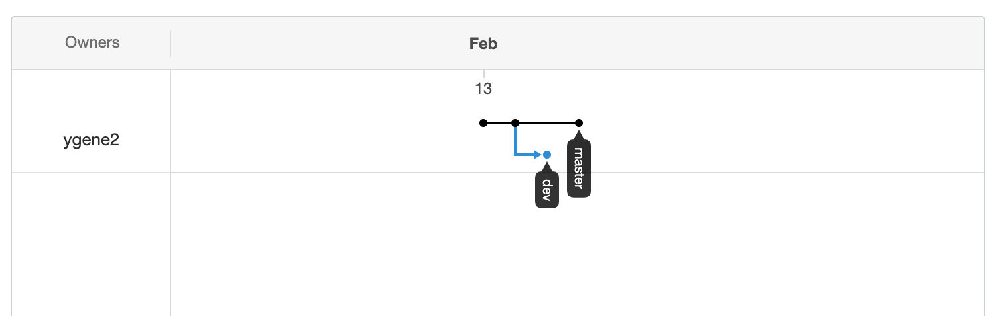


## 4. dev에서 master rebase
- dev로 checkout
    ```bash
    $ git checkout dev
    ```
- dev에서 remote master rebase
    ```bash
    $ git fetch origin
    $ git rebase -i origin/master
    ```
- 다음과 같은 창 나옴
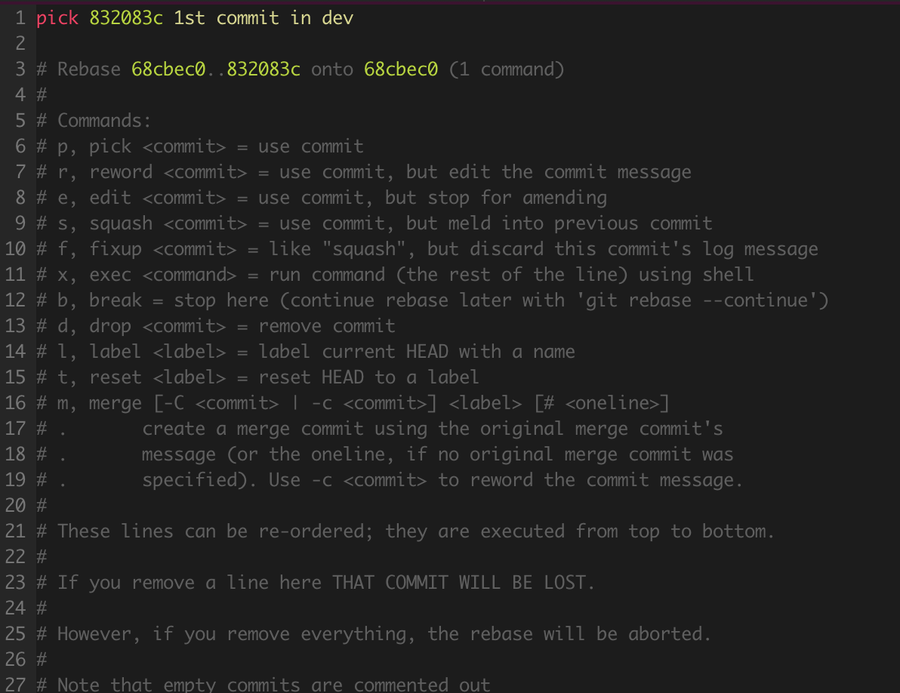

- 적절한 옵션 선택 및 저장하고 창 종료
    - 주로 pick, squash 많이 씀
    - 앞글자만 써도 됨 (예: p)
    - 창종료
        - 명령모드(esc)에서 `:wq` 입력
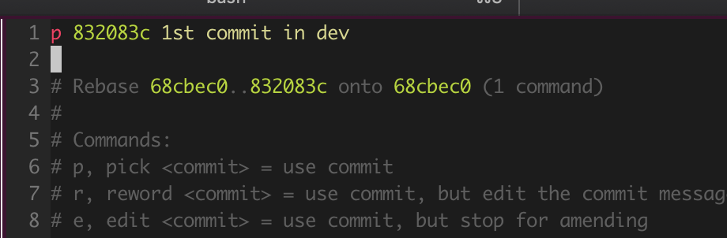
- remote dev로 force push
    ```bash
    $ git push -f origin dev
    ```

- 아래와 같이 remote dev가 remote master에 나란히 붙은걸 확인
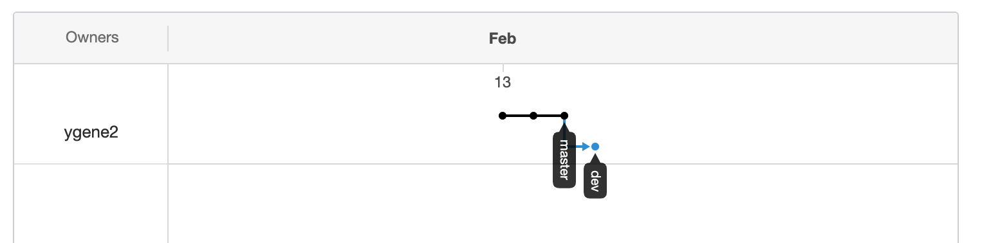

- **여기서 pull request를 날리거나 merge를 하면 충돌 없이 자연스럽게 됨**
    ```bash
    $ git checkout master
    $ git merge dev
    $ git push origin master
    ```
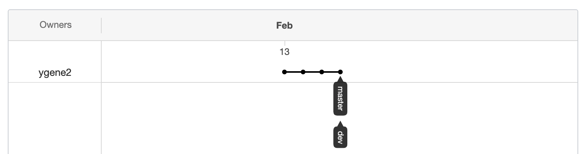

- 작업 완료한 dev branch 삭제
    ```bash
    # delete local dev branch
    $ git branch -d dev

    # delete remote dev branch
    $ git push origin --delete dev
    ```

- 결과를 보면 매우 깔끔하다
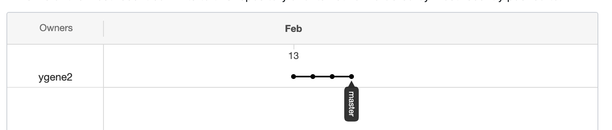

## 5. rebase가 깔끔하게 되지 않는 경우
- 앞서 rebase는 별다른 conflict가 나지 않음
- 그러나 아래와 같은 경우는 rebase하는 도중 문제가 발생함
    - dev에서 작업을 하는 동안 동일한 파일을 누군가 수정

## 6. dev branch 다시 생성해서 작업 진행
- local dev 생성
    ```bash
    $ git checkout -b dev
    ```
- 파일 수정
    - `my_script.py`에 아래 입력
        ```python
        # -*- coding: utf-8 -*-
        
        import time
        
        
        def main():
        
            start_time = time.time()
            for i in range(10):
                print(i)
        
            end_time = time.time()
            print('time elapsed: {} sec'.format(end_time - start_time))
        
        
        if __name__ == '__main__':
        
            main()
        
        ```
    - `new_script.py`에 아래 입력
        ```python
        a = 1
        ```
- remote dev로 push
    ```bash
    $ git add my_script.py
    $ git add new_script.py
    $ git commit -m "1st dev commit"
    $ git push origin dev
    ```

## 7. master에서 동일 파일 수정
- local master checkout
    ```bash
    $ git checkout master
    ```
- 파일 수정
    - `my_script.py`에 아래 입력
        ```python
        # -*- coding: utf-8 -*-
        
        import time
        
        
        def main():
        
            st = time.time()
            for i in range(10):
                print(i)
        
            et = time.time()
            print('time elapsed: {} sec'.format(et - st))
        
        
        if __name__ == '__main__':
        
            main()
        
        ```
    - `new_script.py`에 아래 입력
        ```python
        a = 1
        b = 3
        c = 5
        ```
- remote master로 push
    ```bash
    $ git add my_script.py
    $ git add new_script.py
    $ git commit -m "3rd commit"
    $ git push origin master

## 8. dev에서 master rebase
- local dev로 checkout
    ```bash
    $ git checkout dev
    ```

- rebase remote master
    ```bash
    $ git fetch origin
    $ git rebase -i origin/master
    ```

- 아까와 비슷하게 아래의 화면 나옴 (여기까진 문제 없어 보인다..)
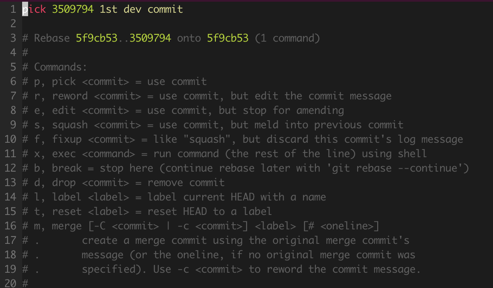

- 그러나 pick하고 저장 후 종료(`:wq`)하면 아래와 같이 confict error가 엄청 나는걸 볼 수 있다....
    - branch도 없다고 나오고 뭔가 큰 문제가 생긴것처럼 보인다..
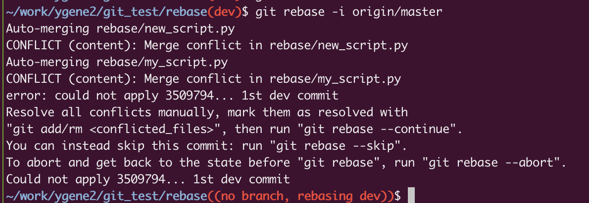

- **만약 잘 모르겠다 싶으면 우선 rebase를 포기하고 이전 상태로 되돌린후 주변에 도움을 청한다**
    ```bash
    $ git rebase --abort
    ```
    - 그럼 아래와 같이 다시 rebase 명령 하기 전으로 돌아감
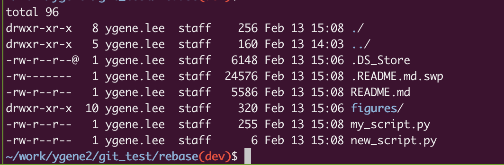

- **conflict를 해결하려면?**
    - git mergetool을 사용
    - 상세 내용은 [merge conflict]를 참고

- 첫번째 파일 conflict 해결
    ```bash
    $ git mergetool
    ```

- 아래와 같은창 나옴
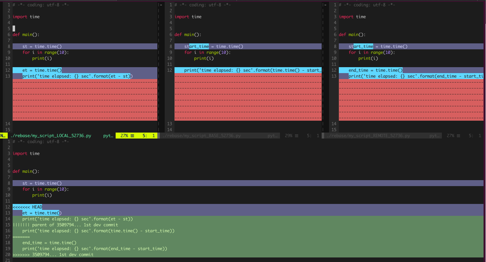


- 하단화면 이동후 (`ctrl + w + ↓`) 충돌난 두개 모두 REMOTE 선택 (LOCAL로 하고 싶으면 그렇게 하면 됨)
    ```
    ]c
    :diffget REMOTE
    ]c
    :diffget REMOTE
    ```
    - edit모드에서 직접 수정해도 된다

- 저장후 종료 (`:wqa!`)

- 그럼 다음 conflict 창이 나옴 (충돌난게 1개면 그냥 종료)
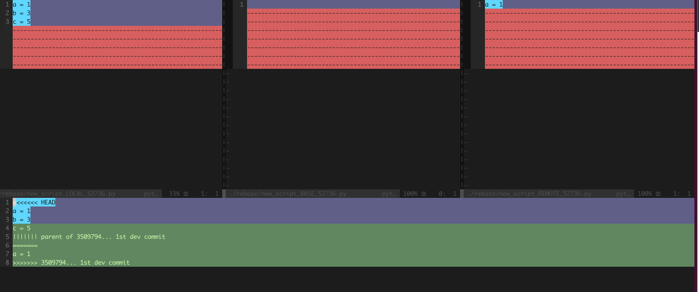

- 하단화면 이동후 (`ctrl + w + ↓`) 이번엔 LOCAL 선택
    ```
    ]c
    :diffget LOCAL
    ```
    - edit모드에서 직접 수정해도 된다

- 저장후 종료 (`:wqa!`)

- editor(vim) 창이 다 닫혔다면 다음 스텝으로
    ```bash
    $ git rebase --continue
    ```
    - 아래와 같이 적절한 commit message 작성하고 종료 (`:wq`)
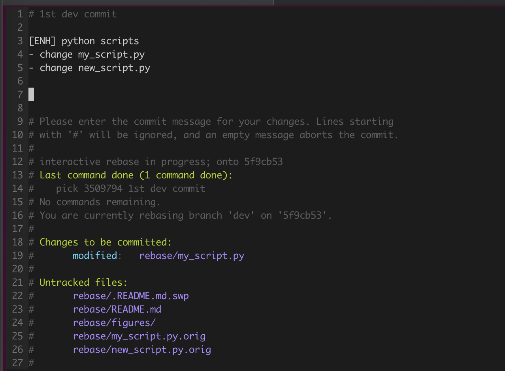

- 아래와같이 conflict가 잘 해결되고 unstaged 파일도 없으면 잘 된거다 (untracked는 문제 없음)
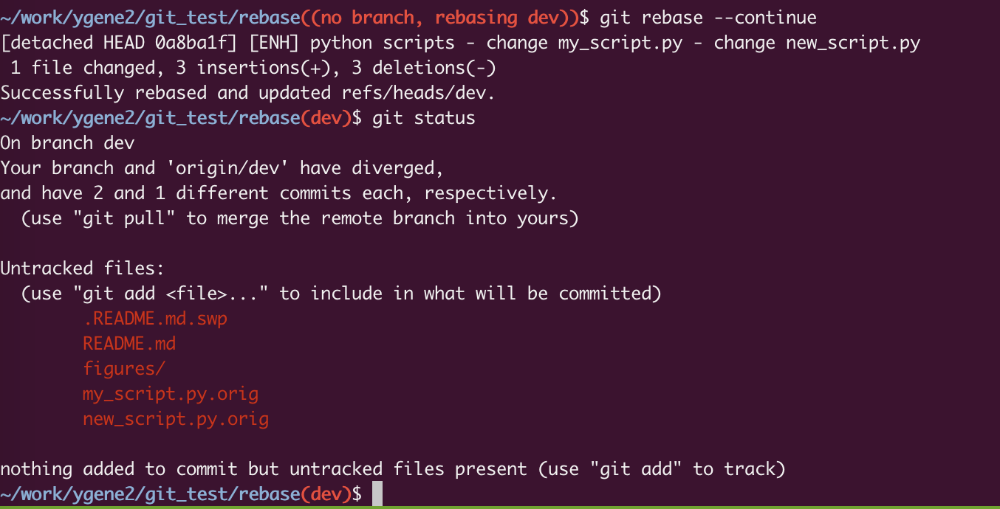

- remote dev로 forece push
    ```bash
    $ git push -f origin dev
    ```

- local master에서 dev branch merge후 remote master로 push
    ```bash
    $ git checkout master
    $ git merge dev
    $ git push origin master
    ```

- local/remote dev branch 삭제
    ```bash
    $ git branch -D dev
    $ git push origin --delete dev
    ```

- 이번에도 깔끔하게 rebase/merge 된것을 볼수 있음
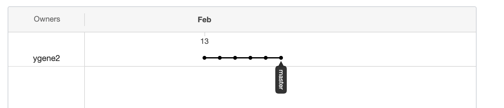


<!--references-->
[merge conflict]: https://github.com/woowabros/datasvc/tree/master/tips/git/merge_conflict
